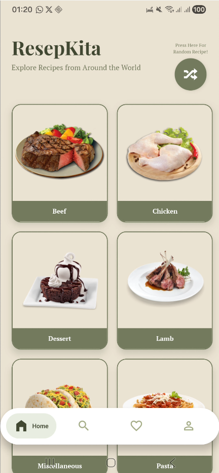
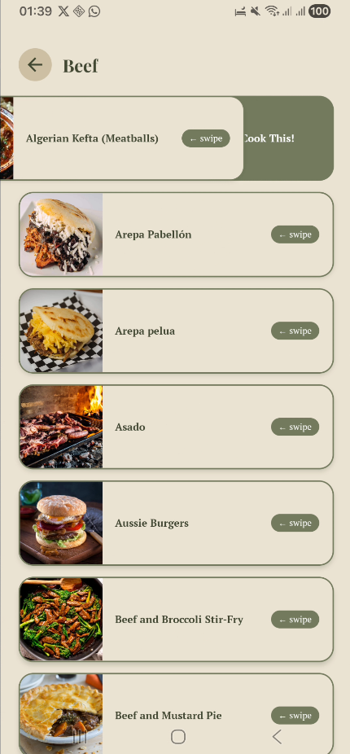
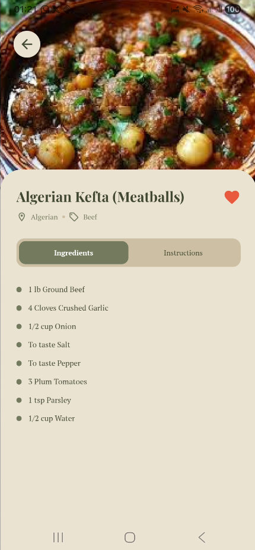
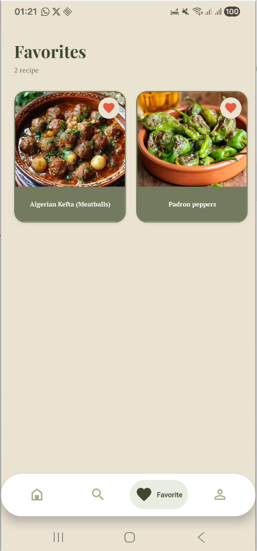
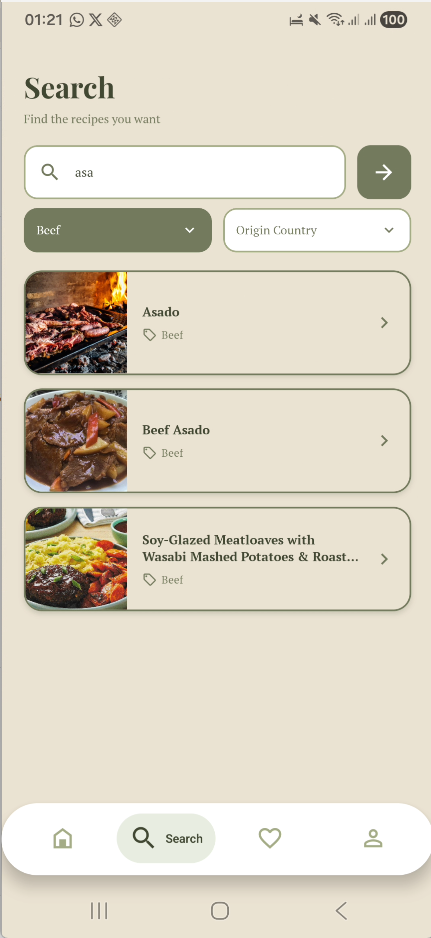
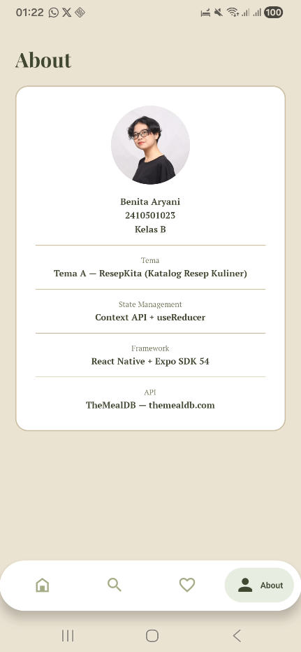

# ResepKita 

**Nama:** Benita Aryani  
**NIM:** 2410501023  
**Kelas:** B

---

## Tema

**Tema A — ResepKita (Katalog Resep Kuliner)**  

---

## Tech Stack

| Package | Versi |
|---|---|
| expo | ~54.0.0 |
| react | 19.1.0 |
| react-native | 0.81.0 |
| @react-navigation/native | ^7.x |
| @react-navigation/stack | ^7.x |
| @react-navigation/bottom-tabs | ^7.x |
| @react-native-async-storage/async-storage | 2.2.0 |
| @expo/vector-icons | ^14.x |
| @expo-google-fonts/playfair-display | latest |
| @expo-google-fonts/pt-serif | latest |

---

## Cara Install & Run

```bash
# 1. Clone repository
git clone https://github.com/lensilen/uts-mobile-lanjut-2410501023-benitaaryani.git

# 2. Masuk ke folder project
cd uts-mobile-lanjut-2410501023-benitaaryani

# 3. Install dependencies
npm install

# 4. Jalankan project
npx expo start
```

Scan QR code menggunakan aplikasi **Expo Go** di HP.

---

## Screenshot

| Screen | Preview |
|---|---|
| Home |  |
| Browse |  |
| Detail |  |
| Favorites |  |
| Search |  |
| About |  |

---

## Video Demo

> Link video demo : [drive](https://drive.google.com/file/d/1-6WmhSGHt-rAj-WLSNOOdHy1ygk-SFTE/view?usp=sharing)
[youtube](https://youtu.be/OiMeXR_GqdA)

---

## State Management

**Pilihan: Context API + useReducer**

Aplikasi ini menggunakan Context API bawaan React dikombinasikan dengan useReducer karena pertama tidak memerlukan library tambahan, kedua sesuai skala aplikasi, saya juga mengkombinasikan dengan AsyncStorage agar data favorit tetap tersimpan meski aplikasi ditutup

---

## Referensi

- [TheMealDB API Documentation](https://www.themealdb.com/api.php)
- [React Navigation Documentation](https://reactnavigation.org/docs/getting-started)
- [React Native PanResponder](https://reactnative.dev/docs/panresponder)
- [React Native Animated API](https://reactnative.dev/docs/animated)
- [Expo AsyncStorage](https://docs.expo.dev/versions/latest/sdk/async-storage/)
- [Expo Google Fonts](https://docs.expo.dev/guides/using-custom-fonts/)
- [React Context API](https://react.dev/reference/react/createContext)
- [React useReducer](https://react.dev/reference/react/useReducer)

---

## Refleksi Pengerjaan

Pengerjaan aplikasi ResepKita cukup menantang terutama karena waktu pengerjaan yang terbatas. Bagian yang paling memakan waktu adalah konfigurasi navigasi antara Bottom Tab Navigator dan Stack Navigator agar bisa berjalan bersamaan dengan benar. Banyak bug yang membuat pusing juga. Selain itu, ada banyak pengalaman baru karena saya mendapatkan banyak waktu untuk mengeksplor lebih dalam dan lebih jauh serta mengimplementasikan beberapa cara website ke mobile, bolak balik dokumentasi resmi React Native secara mandiri. 